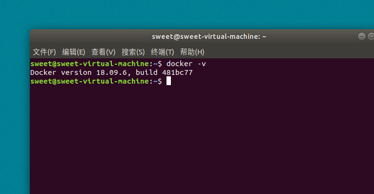

docker-compose 国内镜像安装



1、安装 docker

```
curl -fsSL https://get.docker.com | bash -s docker --mirror Aliyun

```

2、修改 docker 镜像源

```
vim /etc/docker/daemon.json
vi /etc/docker/daemon.json

```
```
{
  "registry-mirrors": [
    "https://registry.docker-cn.com",
    "http://hub-mirror.c.163.com",
    "https://docker.mirrors.ustc.edu.cn"
  ]
}
```

3、启动 docker && 加入开机自启动

```
重启docker
systemctl daemon-reload
systemctl restart docker
查看是否成功
docker info

```

docker启动命令,docker重启命令,docker关闭命令

```
启动        systemctl start docker
守护进程重启   sudo systemctl daemon-reload
重启docker服务   systemctl restart  docker
重启docker服务  sudo service docker restart
关闭docker   service docker stop   
关闭docker  systemctl stop docker
```


4、docker-compose 下载安装  
下载

```
curl -L https://get.daocloud.io/docker/compose/releases/download/1.24.0/docker-compose-`uname -s`-`uname -m` > /usr/local/bin/docker-compose

```

设置可运行

```
chmod +x /usr/local/bin/docker-compose

```

版本检查

```
docker-compose --version

```

[参考链接](https://blog.csdn.net/huiyanghu/article/details/82253886)

查看硬盘状况

```

df -lh

> 文件系统                 容量  已用  可用 已用% 挂载点
> devtmpfs                 874M     0  874M    0% /dev
> tmpfs                    886M     0  886M    0% /dev/shm
> tmpfs                    886M  9.5M  877M    2% /run
> tmpfs                    886M     0  886M    0% /sys/fs/cgroup
> /dev/mapper/centos-root   27G  1.6G   26G    6% /
> /dev/sda1               1014M  150M  864M   15% /boot
> tmpfs                    178M     0  178M    0% /run/user/0
```